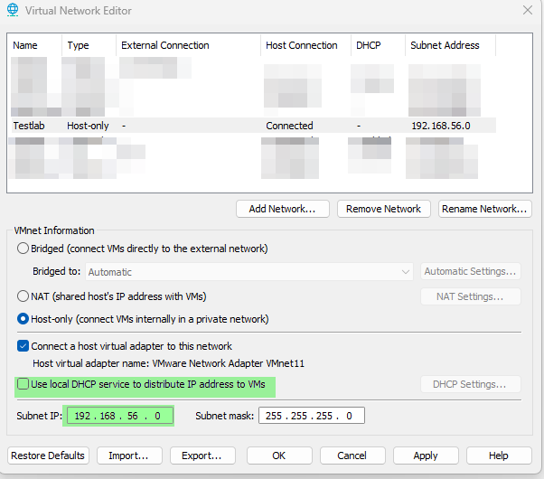

# Create a Basic Active Directory Lab

This guide walks you through creating a minimal lab environment for Windows domain attack and defense simulations. It includes one domain controller, two Windows 11 workstation, and one Kali Linux machine — all within the same subnet.


## 1. Lab Overview

### 1.1 Lab Objectives
- Simulate real-world domain environments
- Demonstrate credential theft and detection
- Serve as foundation for blue and red team exercises

### 1.2 Lab Topology


## 2. Resources

### Operating System ISOs

| Name                | Link                                                                 |
|---------------------|----------------------------------------------------------------------|
| Windows Server 2025 | https://www.microsoft.com/en-us/evalcenter/download-windows-server  |
| Windows 11 Pro      | https://www.microsoft.com/software-download/windows11               |
| Kali Linux          | https://www.kali.org/get-kali/                                       |

### Microsoft Tools

| Name              | Link                                                                                  |
|-------------------|----------------------------------------------------------------------------------------|
| Sysinternals Suite | https://learn.microsoft.com/en-us/sysinternals/downloads/sysinternals-suite          |
| RSAT Tools*         | https://learn.microsoft.com/en-us/windows-server/remote/remote-server-administration-tools |

\* RSAT Tools are optional as we config the DC locally

### Security Tools

| Name      | Link                                                      |
|-----------|-----------------------------------------------------------|
| Responder | https://github.com/lgandx/Responder                       |
| Wireshark | https://www.wireshark.org/                                |
| Hashcat   | https://hashcat.net/hashcat/                              |
| Mimikatz  | https://github.com/gentilkiwi/mimikatz                    |


## 3. Virtual Machine Setup

### 3.1 Platform Requirements
- Recommended: VirtualBox, VMware Workstation, or Hyper-V

### 3.2 VM Configuration

| VM Name     | Role                | OS Version            | CPU | RAM  | Disk  |
|-------------|---------------------|------------------------|-----|------|--------|
| DC01        | Domain Controller   | Windows Server 2025    | 2   | 4 GB | 40 GB  |
| WIN11-CL01  | Workstation Client  | Windows 11 Pro         | 2   | 4 GB | 40 GB  |
| KALI01      | Attacker VM         | Kali Linux (latest)    | 2   | 2 GB | 20 GB  |


## 4. Network Configuration

### 4.1 Network Options in VMware Workstation

VMware offers several types of virtual networks. Choosing the right one is critical to how your lab behaves — especially for isolation, visibility, and control.

| Network Type    | Description                                                                 | Internet Access | Use Case                     |
|------------------|-----------------------------------------------------------------------------|------------------|-------------------------------|
| [**NAT**](https://docs.vmware.com/en/VMware-Workstation-Pro/17.0/com.vmware.ws.using.doc/GUID-9D66C22F-4B79-4CE1-866E-9BA62F68E1F2.html) | VMs share the host's IP and access the internet through a network address translation (NAT) layer. | Yes | For general use with updates |
| **Bridged**      | VMs appear as full devices on the same network as the host.                 | Yes              | For integration with LAN      |
| **Host-Only**    | VMs can communicate with each other and the host, but **not the internet**. | No               | Ideal for isolated test labs  |
| **Custom (VMnetX)** | Manually created host-only or isolated networks                         | Depends          | Used for multiple lab setups  |


### 4.2 Why We Use Host-Only for This Lab

For this lab, we intentionally isolate all virtual machines from the internet and external networks by using a **host-only** network. This provides:

- **Isolation:** No internet access = no interference, telemetry, or external exposure
- **Control:** You fully control routing, DNS, and firewall rules
- **Stability:** No updates or background processes affecting traffic or timing
- **Safety:** You can run attack tools without leaking anything onto a real network

This setup is perfect for demonstrating credential theft (like LLMNR poisoning), malware simulation, or attack chains — without the risk of impacting production systems.

### 4.3 Create a Host-Only Network in VMware

1. Open **VMware Workstation**
2. Go to **Edit > Virtual Network Editor**
3. Click **"Add Network..."**, select an unused VMnet (e.g., `VMnet2`)
4. Configure it as:
   - **Host-only**
   - **Disable DHCP**
   - **Set subnet manually**, e.g.:
     - Subnet IP: `192.168.56.0`
     - Subnet Mask: `255.255.255.0`

> This creates a closed, offline virtual network for your lab only.



### 4.4 Assign the Network to All VMs

- Open settings for each VM: `DC01`, `WIN11-CL01`, and `KALI01`
- Set **Network Adapter** to **"Custom" > VMnet2** (or your selected VMnet)
- Ensure **all three VMs** use the same custom host-only network


### 4.5 Assign Static IP Addresses

Assign the following IPs manually inside each operating system:

| Hostname     | IP Address       | Notes                      |
|--------------|------------------|----------------------------|
| DC01         | 192.168.56.10    | Domain Controller          |
| WIN11-CL01   | 192.168.56.11    | Windows workstation        |
| WIN11-CL02   | 192.168.56.12    | Windows workstation        |
| KALI01       | 192.168.56.15    | Kali attacker (Responder)  |

> Tip: After configuration, test connectivity with `ping` between all systems before proceeding.


## 5. Windows Server 2025 Setup (DC01)

### 5.1 Install Windows Server
## 5.1 Install Windows Server 2025

Start by installing Windows Server 2025 on the virtual machine labeled `DC01`. This machine will serve as your domain controller.

### Installation Steps (Summary)

1. Create a new VM in VMware Workstation
2. Mount the Windows Server 2025 ISO (see [Resources](#2-resources))
3. Boot the VM and follow the on-screen setup
4. Choose:
   - Edition: **Standard Edition (Desktop Experience)** or equivalent
   - Language and region settings as preferred
5. Create a local Administrator password (secure but memorable)
6. Once installed, install VMware Tools and reboot

> Ensure you assign the machine a static IP before promoting it to a domain controller in later steps.

### Need Visual Help?

If you're unfamiliar with installing Windows Server, follow this video tutorial:

[Basic Windows Server 2025 Installation Guide (YouTube)](https://youtu.be/fbfSKgV2in8?si=7LoS7RCeenfELb87)

This video covers the base install process step-by-step.

### 5.2 Configure Hostname and Static IP
#### Set Hostname
Open PowerShell as Administrator and run:
```powershell
Rename-Computer -NewName "DC01" -Force -Restart
```
#### Set Static IP Address
```powershell
# Get Network Adapter Name
Get-NetAdapter

# Set static IP on Interface "Ethernet"
New-NetIPAddress -InterfaceAlias "Ethernet" -IPAddress 192.168.56.10 -PrefixLength 24 -DefaultGateway 192.168.56.1
Set-DnsClientServerAddress -InterfaceAlias "Ethernet" -ServerAddresses 127.0.0.1
```
##### Description
This assigns:
- IP: 192.168.56.10
- Subnet: 255.255.255.0 (/24)
- Gateway: 192.168.56.1 (can be a dummy if no internet is needed)
- DNS Server: localhost (127.0.0.1) — required before promoting to a DC

### 5.3 Install AD DS Role
Open PowerShell as Administrator and run:
```powershell
Install-WindowsFeature -Name AD-Domain-Services -IncludeManagementTools
```
### 5.4 Promote to Domain Controller (`discordia.local`)
Open PowerShell as Administrator and run the following command to create a new forest:

```powershell
Install-ADDSForest `
    -DomainName "discordia.local" `
    -DomainNetbiosName "DISCORDIA" `
    -SafeModeAdministratorPassword (Read-Host -AsSecureString "Enter DSRM password") `
    -InstallDNS `
    -Force
```
> __Note:__ After completion the Server will restart.

##### Description

- DomainName: The fully qualified domain name (FQDN)
- DomainNetbiosName: NetBIOS name shown in legacy tools (uppercase preferred)
- InstallDNS: Installs and configures DNS on this DC
- SafeModeAdministratorPassword: Required for Directory Services Restore Mode (DSRM)
- Force: Skips confirmation prompts

### 5.5 Create User Accounts for Testing
This step sets up the test user accounts you’ll need in your lab. One account will be a **non-privileged domain user**, and the other will be a **local admin account** for initial setup on the Windows 11 workstation.

#### Step 1: Create a Domain Admin Account (`r.deschain`)
On `DC01`, open PowerShell as Administrator:
```powershell
# Create User
New-ADUser -Name "Roland Deschain" `
    -SamAccountName "r.deschain" `
    -UserPrincipalName "r.deschain@discordia.local" `
    -AccountPassword (Read-Host -AsSecureString "Set password for r.deschain") `
    -Enabled $true

# Adding to "Domain Admins" Group
Add-ADGroupMember -Identity "Domain Admins" -Members "r.deschain"
```

#### Step 2: Create a Domain User (`jchambers`)

On `DC01`, open PowerShell as Administrator:
```powershell
New-ADUser -Name "jchambers" `
    -SamAccountName "jchambers" `
    -UserPrincipalName "jchambers@discordia.local" `
    -AccountPassword (Read-Host -AsSecureString "Set password for jchambers") `
    -Enabled $true
```

## 6. Windows 11 Client Setup (WIN11-CL01)
### 6.1 Install Windows 11

In this step, you'll install Windows 11 Pro on the virtual machine `WIN11-CL01` and `WIN11-CL02`. 
This machines will later be joined to the `discordia.local` domain and used to simulate user behavior or attack targets.

#### Installation Overview

1. Create a new virtual machine in **VMware Workstation**
2. Attach the **Windows 11 ISO** (see [Resources](#2-resources)) as the boot disk
3. Boot the VM and start the installer
4. Choose:
   - **Edition:** Windows 11 Pro
   - **Custom install** (not upgrade)
   - Create a new partition on the virtual disk
5. Follow the OOBE prompts:
   - Region, keyboard layout, etc.
   - Skip or disable Microsoft account login (choose "Offline Account")
   - Name the device: `WIN11-CL01`
   - Set a temporary local admin account (e.g., `localadmin`)

6. Once the setup is complete:
   - Log in with the local admin account
   - Install VMware Tools for proper drivers and integration

> Tip: Do not join the domain yet — this will be handled in the next steps.


#### Video Guide (Optional)

If you're new to Windows 11 installation or want to follow along visually, this guide walks through the full process:

[Windows 11 Pro Installation Guide (YouTube)](https://youtu.be/EMuw_IN-UOU?si=4v9BcCVfuMc7S7Uo)

### 6.2 Configure Network and Hostname
### 6.3 Join the Domain (`discordia.local`)
### 6.4 Log In with Test User

---

## 7. Kali Linux Setup (KALI01)

### 7.1 Install Kali Linux
### 7.2 Configure Hostname and Network
### 7.3 Update and Install Tools

## 8. Credits and External Resources

- [Windows Server 2025 Installation Video](https://youtu.be/fbfSKgV2in8?si=7LoS7RCeenfELb87) by Danny Moran
- [Windows 11 Installation Guide](https://youtu.be/EMuw_IN-UOU?si=4v9BcCVfuMc7S7Uo) by John Hammond

